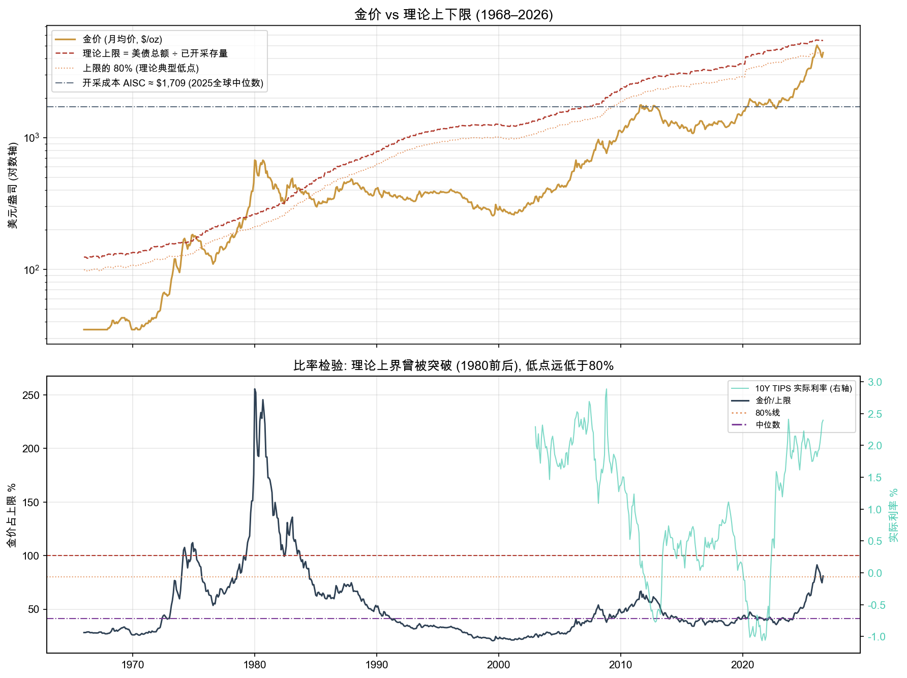
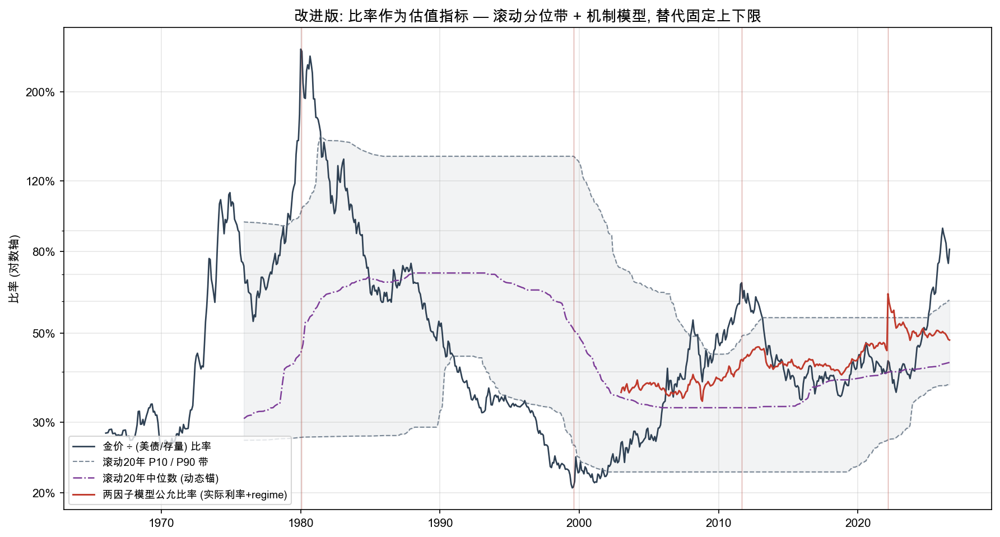

# Gold Price Analysis · 黄金"债务锚"定价理论的实证检验与改进

**Testing and rebuilding a folk gold-pricing model: extraction-cost floor, a "U.S. debt ÷ gold stock" ceiling, and the 80%-of-ceiling trough rule.**

[English](#english) · [中文](#中文)

---

## 中文

### 研究问题

一个流传的黄金定价框架声称：

1. **下限**：金价不会低于开采成本（AISC）；
2. **上限**：金价不会高于 `美债总额 ÷ 已开采黄金存量`；
3. **典型低点** ≈ 上限的 80%；
4. 利率与利率预期通过"压缩金价占上限的百分比"起作用。

本项目用 57 年月度数据对这四条命题逐一做**可证伪检验**（V1），并在证伪之后把框架**重建为可用的估值工具**（V2）。

### 核心结论（V1 · 证伪）

| 命题 | 检验结果 |
|---|---|
| ② 上限不可突破 | **被证伪**。1974.03–1983.09 共 60 个月金价高于上限，1980 年 1 月达上限的 **256%** |
| ③ 低点 ≈ 80% 上限 | **被证伪**。历史主要低点：1976 年 53.5%、1985 年 62.2%、1999 年 20.7%、2015 年 34.0%；全样本比率区间 20.5%–255.5%，中位数 41.1%。"80%" 恰好等于当前值（80.9%），是典型的后视镜拟合 |
| ① 成本下限 | **部分成立但是"软底"**。1999–2001 年金价贴近现金成本但未持续击穿；当前金价为 AISC 的 2.6 倍，约束不起作用 |
| ④ 利率压缩比率 | **方向成立、强度弱**。比率同比变化 vs 实际利率同比变化相关 **-0.34**，水平值相关仅 -0.11 |

### 改进框架（V2 · 重建）

- 比率保留为**估值标尺**而非硬边界，贵贱由**滚动 20 年分位带**（P10/P50/P90）判断，带随 regime 自适应漂移；
- 公允比率由机制模型给出：`log(比率) = -0.838 - 0.085×实际利率 + 0.309×(2022后央行购金regime)`，R²=0.24（单变量实际利率仅 0.03）。实际利率每升 1 个百分点，比率压缩 8.2%；2022 年后中枢结构上移 36.3%；
- Regime 分段显示比率中位数在 32%–74% 之间漂移，任何估值必须先声明所处 regime。

**当前读数（2026 年 8 月）**：比率 80.9%，处于近 20 年窗口的**第 98 分位**（P90 = 60%）；两因子模型公允比率约 48%，偏离 +68.5%。注意 R²=0.24，偏离中可能有一半是模型未捕捉的结构变化（如央行购金的持续性），不构成投资建议。

### 数据与复现

- 美债：FRED `GFDEBTN`（季度，1966–2026）；实际利率：FRED `DFII10`（10Y TIPS）
- 金价：世界银行 Pink Sheet 月均价（1960–2026.08），已随仓库附带于 `data/CMO-Monthly.xlsx`
- 已开采存量：WGC 估计 2026 年中约 222,600 吨，按约 1.7%/年回推，与 GFMS/WGC 历史锚点一致（2013: 171,300 t；2023: 212,582 t；2024 末: 216,265 t）

```bash
pip install -r requirements.txt
python v1_falsification/verify_gold_model.py    # 生成 v1 图表与 data/gold_model_data.csv
python v2_regime_model/verify_gold_model_v2.py  # 生成 v2 图表与 data/gold_model_data_v2.csv
```

### 目录结构

```
├── v1_falsification/      # V1 证伪检验: 脚本 + 双面板图
├── v2_regime_model/       # V2 改进框架: 滚动分位带 + 两因子机制模型
├── data/                  # 原始数据(Pink Sheet) + 两个版本的逐月结果
├── LICENSE                # MIT (代码)
├── NOTICE                 # 第三方数据来源与归属
└── requirements.txt
```

### 局限

存量回推采用常数增速近似（±几个百分点，不改变结论量级）；AISC 概念 2013 年才标准化，早期以现金成本近似；两因子模型为教学级原型，未含美元指数、央行购金流量等因子。**本项目仅为方法论研究，不构成投资建议。**

---

## English

### Research question

A widely circulated folk model of gold pricing claims: (1) a hard floor at extraction cost (AISC); (2) a hard ceiling at *U.S. federal debt ÷ total above-ground gold stock*; (3) cyclical troughs at ~80% of that ceiling; (4) interest rates acting by compressing the price-to-ceiling ratio. This repository subjects each claim to a falsifiable test on 57 years of monthly data (V1), then rebuilds the framework into a usable valuation gauge (V2).

### Key findings (V1 · falsification)

- **The ceiling was violated for 60 consecutive months** (1974–1983); in January 1980 gold reached **256%** of the supposed ceiling.
- **No historical trough sits near 80% of the ceiling**: 1976: 53.5%, 1985: 62.2%, 1999: 20.7%, 2015: 34.0%. The full-sample ratio spans 20.5%–255.5% (median 41.1%). The "80%" figure simply equals today's reading (80.9%) — a hindsight fit.
- **The cost floor is real but soft**: gold hugged cash costs in 1999–2001 without durably breaking them; today price is 2.6× AISC, so the floor is not binding.
- **Rates compress the ratio, weakly**: corr(YoY changes in ratio, YoY changes in 10Y TIPS yield) = **-0.34**; level correlation only -0.11.

### Rebuilt framework (V2)

- The ratio is kept as a **valuation gauge**; extremes are read from a **rolling 20-year quantile band** (P10/P50/P90) that drifts with the monetary regime.
- A two-factor fair-value model, monthly 2003–present:
  `log(ratio) = -0.838 − 0.085·(real 10Y yield) + 0.309·(post-2022 CB-buying regime)`, R² = 0.24 (vs 0.03 for real yields alone).
- Regime segmentation (ratio medians): 1971-80 stagflation 74%, 1981-99 strong dollar 46%, 2000-11 QE 32%, 2012-21 new normal 41%, 2022-26 CB-buying wave 46%.

**Current reading (Aug 2026)**: ratio 80.9% = **98th percentile** of the trailing 20-year window (P90 = 60%); model fair ratio ≈ 48%, deviation +68.5%. With R² = 0.24, part of that gap is likely regime shift the model does not capture (e.g., persistent central-bank buying). Not investment advice.

### Figures

| V1 — prices vs claimed bounds; ratio vs real rates | V2 — rolling quantile band + mechanism model |
|---|---|
|  |  |

### Data & reproduction

- U.S. debt: FRED `GFDEBTN`; real rates: FRED `DFII10` (10Y TIPS)
- Gold: World Bank Commodity Price Data ("Pink Sheet"), monthly averages 1960–Aug 2026, bundled at `data/CMO-Monthly.xlsx`
- Above-ground stock: World Gold Council estimate ~222,600 t (mid-2026), back-cast at ~1.7 %/yr, consistent with GFMS/WGC anchors (2013: 171,300 t; 2023: 212,582 t; end-2024: 216,265 t)

```bash
pip install -r requirements.txt
python v1_falsification/verify_gold_model.py
python v2_regime_model/verify_gold_model_v2.py
```

### Limitations

Constant-growth stock back-cast (± a few percent; does not change the order of magnitude of any result); AISC only standardized after 2013 (cash costs used earlier); the two-factor model is a teaching-grade prototype without DXY, central-bank flows, etc. **Methodological research only — not investment advice.**

### Citation

```bibtex
@misc{gold_price_analysis_2026,
  title  = {Gold Price Analysis: Falsification and Rebuild of a Debt-Anchored Gold Pricing Model},
  author = {liuxingcong},
  year   = {2026},
  note   = {Data: World Bank Pink Sheet; FRED (GFDEBTN, DFII10); World Gold Council}
}
```

### License

Code: [MIT](LICENSE). Third-party data attribution: see [NOTICE](NOTICE).
